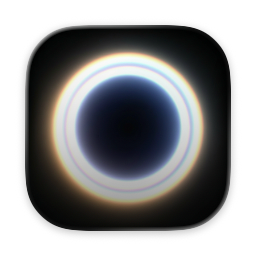

<h1 align="center">Impulse</h1>

A native personal assistant for coding and desk work on macOS.

Speak, type, or show what's on your screen. Impulse helps you turn ideas, questions, errors, and documents into action.

## Why Impulse

Impulse is designed for people who work across code, documents, browser tabs, screenshots, terminals, and ideas all day long.

Instead of forcing everything into a text box, Impulse lets you work the way you already do on macOS: type when you want precision, speak when your hands are busy, and pull in what is already on screen when context matters more than re-explaining it.

It is built to feel like a capable desktop tool, not just another chat window.

## Product Features

### Talk, type, and work naturally
Use natural language the way you actually think. Start with a quick prompt, hold to speak, or switch between text and voice as the task changes.

### Screen-aware assistance
Bring your current screen into the conversation with screenshot analysis and OCR. Error messages, UI states, web pages, notes, and visual context can all become part of the task instantly.

### Built for coding and desk work
Impulse is not limited to one kind of workflow. It can help you reason through code, explain existing logic, analyze documents, summarize information, and move through day-to-day work with less friction.

### Powerful, not lightweight
Impulse is made for real tasks, not just quick replies. It is designed to handle multi-step work, richer context, and workflows that move from understanding to execution.

### See what the assistant is doing
When tools are used, the process stays visible. File access, edits, writes, and terminal actions are surfaced clearly, so the assistant feels inspectable instead of opaque.

### Safety with clear boundaries
Impulse uses sandboxed access controls so powerful capabilities stay inside explicit boundaries. It is designed to be useful without feeling reckless.

## Preview

## System Requirements

- macOS 15.7 or later

## Installation

### Download the app

Download the latest release from GitHub:

- [Latest Release](https://github.com/section9-lab/Impulse/releases/latest)

### Build from source

1. Clone this repository
2. Open `Impulse.xcodeproj` in Xcode
3. Configure your model provider in Settings
4. Build and run

## Privacy and Safety

- Access stays scoped to what you allow
- Sandbox boundaries help keep the assistant operating within explicit limits
- Model provider configuration is flexible, so you can choose the setup that fits your workflow

## License

MIT
