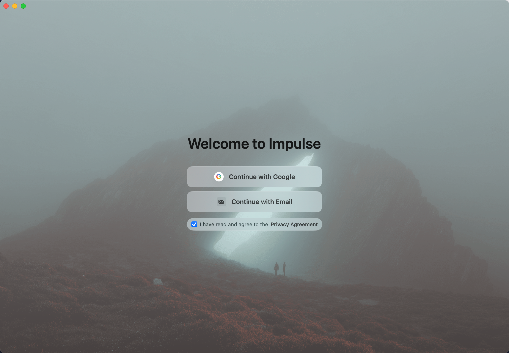
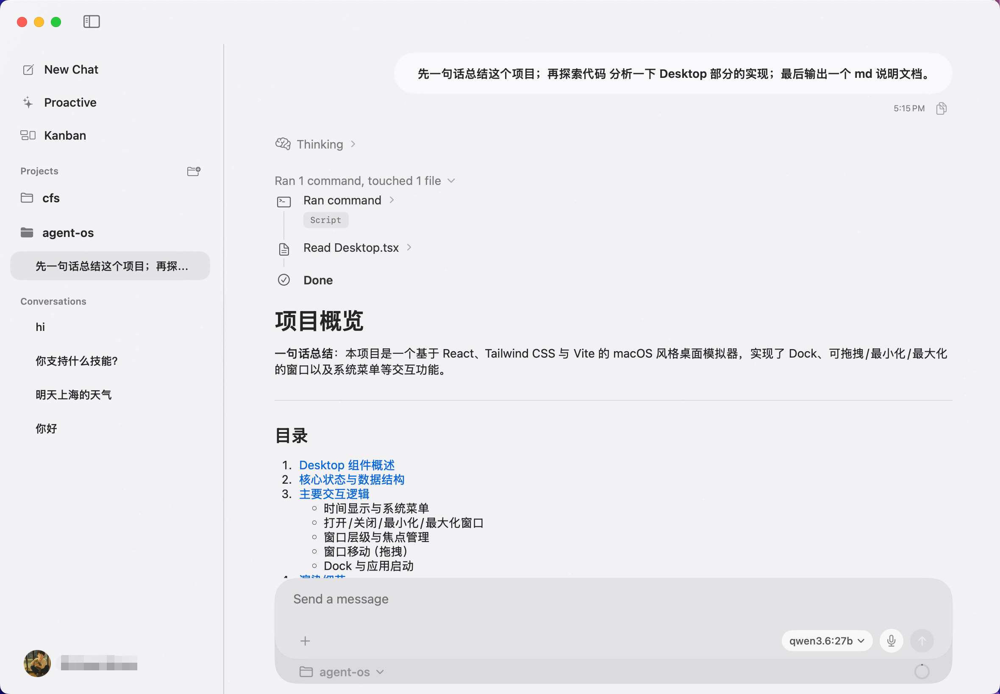

<div align="center">


<h1>Impulse</h1>

<p><b>A native macOS assistant that sees your screen, hears your voice, and remembers your projects — running locally with the model you choose.</b></p>

[](LICENSE)
[](https://github.com/section9-lab/Impulse/releases/latest)
[](https://www.apple.com/macos/)
[](https://github.com/section9-lab/Impulse/stargazers)

</div>

<!--
  TODO: replace with a 20–30s demo GIF showing
  hotkey wake → voice prompt → screen-aware reply → kanban update.
  Drop the file at public/demo.gif and uncomment the block below.

  <p align="center">
    
  </p>
-->

<p align="center">
  
</p>

<p align="center">
  
</p>

## Why Impulse

A desktop assistant should *do* things, not just *answer* things. Most AI desktop apps are chat windows with a fancier wrapper. Impulse is built around how you actually work on macOS — across screens, voices, projects, and tools.

|  | Impulse | ChatGPT Desktop | Raycast AI | Ollama wrappers |
|---|---|---|---|---|
| Native macOS app | Yes | Yes | Yes | Varies |
| Sees your screen (OCR + capture) | Yes | Partial | No | No |
| Voice input out of the box | Yes | Yes | No | No |
| Project memory across sessions | Yes | No | No | No |
| Bring your own model (local or cloud) | Yes | No | Partial | Local only |
| Open source, Apache-2.0 | Yes | No | No | Mixed |

## Features

### Talk or type, your call
Hold to speak, or type when you want precision. Speech is on-device via the Speech framework — no audio leaves your Mac.

### Screen-aware context
Bring whatever's on your screen into the conversation: error dialogs, web pages, design mocks, terminal output. OCR runs locally with the Vision framework.

### Project memory
Conversations are scoped to projects and persisted as JSONL on disk. Restart the app, switch sessions, come back tomorrow — context survives. A built-in kanban keeps tasks attached to the right project.

### Bring your own model
Configure any OpenAI-compatible endpoint, or point Impulse at a local Ollama / LM Studio instance. Switch models per-session without restarting.

### Privacy by design
Files stay scoped to folders you grant via security-scoped bookmarks. Tool calls — file reads, edits, terminal actions — surface in the UI before they happen. No telemetry.

### In progress (next release)
- **Schedule helper** — pull today's calendar, surface conflicts, remind you ahead of meetings
- **Inbox helper** — summarize mail and messages, extract todos
- **Action helper** — one-line triggers like "remind me at 4pm" or "prep for the standup"

## Quick Start

```bash
# 1. Download the latest .dmg
open https://github.com/section9-lab/Impulse/releases/latest

# 2. Drag Impulse.app into /Applications, then launch it

# 3. Open Settings → Model Provider, paste an OpenAI-compatible
#    endpoint + key, or point at http://localhost:11434 for Ollama
```

That's it. Grant Screen Recording and Microphone permissions when macOS prompts you.

> Building from source? See [CONTRIBUTING.md](CONTRIBUTING.md).

## System Requirements

- macOS 14.0 or later
- Apple Silicon or Intel
- An OpenAI-compatible endpoint, or a local model runner (Ollama, LM Studio)

## How it works

- **SwiftUI + SwiftData** for the native UI and per-project state
- **Vision framework** for on-device OCR; **Speech framework** for dictation
- **Security-scoped bookmarks** for sandboxed file access without giving up `NSOpenPanel` ergonomics
- **JSONL session log** per project — conversations are diffable, greppable, and survive app restarts
- **Pluggable provider layer** — any OpenAI-compatible HTTP endpoint, or a local Ollama / LM Studio
- **Tool calls are visible** — file reads, edits, and shell actions surface in the chat before they run

## Roadmap

- [x] Native macOS UI with chat + sidebar + project board
- [x] Voice input, screen capture, OCR
- [x] JSONL session persistence per project
- [x] Multi-provider support (OpenAI-compatible, Ollama)
- [ ] Schedule / Inbox / Action helpers *(in progress)*
- [ ] Global hotkey wake
- [ ] Cross-app actions (Calendar, Reminders, Mail, Notes, Browser)
- [ ] Per-user memory and preferences

## Privacy

- All speech recognition and OCR runs **on-device**
- Conversations are stored as plain JSONL under `~/Library/Application Support/Impulse/`
- File access is gated by macOS security-scoped bookmarks — Impulse only sees folders you grant
- Choose your own model provider; nothing is hardcoded to a vendor
- No analytics, no telemetry, no account required

## Star History

[](https://star-history.com/#section9-lab/Impulse&Date)

## License

[Apache License 2.0](LICENSE)
